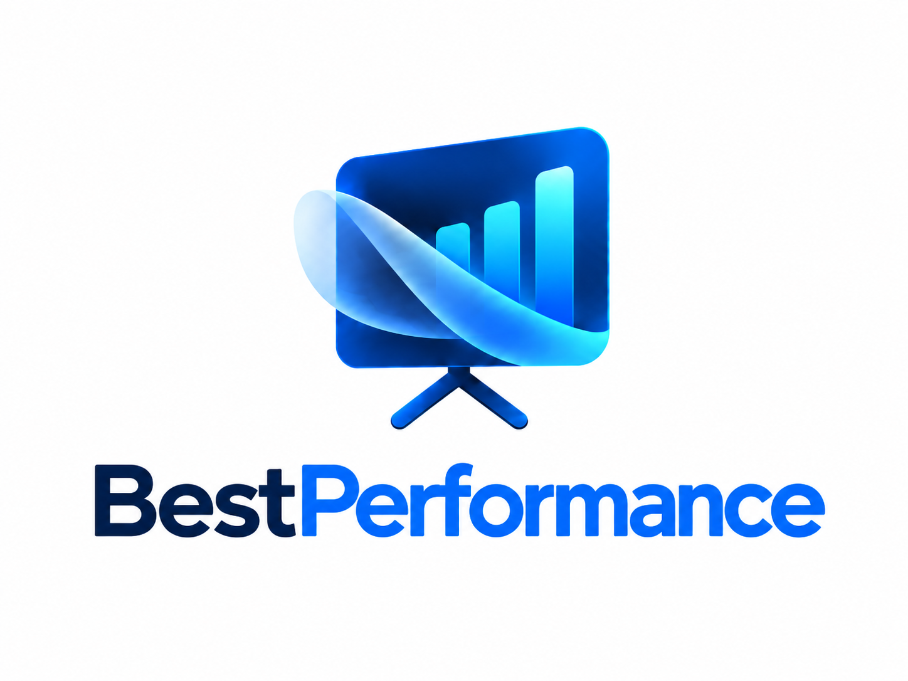

<p align="center">
  
</p>

<p align="center">
  <a href="#english"><b>English</b></a>
  &nbsp;·&nbsp;
  <a href="#russian">Русский</a>
</p>

<p align="center">
  <a href="https://github.com/Edgunteralfa">Edgunteralfa</a> (EdHunter)
  · <a href="https://github.com/Edgunteralfa/BestPerformance">github.com/Edgunteralfa/BestPerformance</a>
  · 1.0.0
</p>

<p align="center">
  
  
  
</p>

<p align="center">
  <b>Support</b><br>
  The app is free. If it is useful, you can send <b>USDT (TRC-20)</b>.<br>
  Программа бесплатная. Если она пригодилась, можно отправить <b>USDT (TRC-20)</b>.<br>
  <code>TBoBBxmpbk5nkZWnaVK9nuDB4XH5c72mo7</code><br>
  
</p>

<details open>
<summary><b id="english">English</b></summary>

Notes on your screen. A recording and a screen share do not get them.

BestPerformance is free forever, for everyone.

Pitches and calls pile up. Sometimes there is no evening left to rehearse, and sometimes the brief is longer than the slot. BestPerformance started from that: a private script you can read while the other person only sees the slides.

## Who it is for

- A pitch or a customer call, when the deck is ready and the wording is not.
- A teacher or a lecturer sharing their own screen. The class sees the slides. The speaker still has the plan, the aside, and the number they did not want to forget.
- A lead on a group call: the agenda, the decision you need, and the question you were going to ask last.
- Someone giving a status report: three chapters, the figures in the second window, and a clock so the update stays inside the time you were given.

On Windows the window is left out of screen capture in Zoom, Microsoft Teams, VooV, Tencent Meeting, OBS, Webex, Yandex Telemost, the Snipping Tool, Bandicam, and other screenshot tools and video capture apps that use the same Windows capture. It stays above other programs. In Alt+Tab and in the share list it uses an ordinary system name, Node Terminal by default. You can pick another in settings. The share preview is empty. The Alt+Tab icon is still the BestPerformance icon.

Do not take it into an exam, and do not use it to step around a school rule, a workplace rule, or someone else's terms. You decide how it is used.

## Chapters, then a saved talk

One talk lives in tabs. Six tabs is the limit. Each tab has its own text, name, and color.

A chapter is a line you mark with **H**, or a line that starts with `# `. On a wide window those lines become the list on the left. Click one to jump. `Ctrl+Shift+←` and `Ctrl+Shift+→` move between chapters and leave the arrow keys for your slides. `Ctrl+Alt+↑` and `Ctrl+Alt+↓` walk the lines inside the current chapter. A white bar sits on the line you are reading.

Give a chapter a time in the field beside its name, `0:45` or `1:30`. The label turns yellow in the last 15 percent and red when the time is gone. The window edge flashes red once. **Review** shows how long each chapter actually took.

A practical split:

| Tab | What goes there |
| --- | --- |
| Pitch | The story, one chapter per beat |
| Questions | What they will ask, answer on the next line |
| Numbers | Only if it is long; short figures belong in the **12** window |
| Close | The ask, the date, the next step |

The **12** window is a second page for figures and definitions. It has its own type size and its own opacity. Closing it hides it. It does not quit the app.

## Thirty talks in memory

Settings, **Saved pitches**, stores the tabs, the chapter times, and the facts window under a name you choose. You can keep 30. A short tag and a color sit on the row so a lecture, a pitch, and a weekly meeting are easy to tell apart.

**Open** brings that talk back in full and keeps the draft you were writing. **Delete** removes only the saved copy. Whatever is on screen stays.

## Carry it on a USB stick

The portable zip is the same program without an installer. Unpack it and leave the empty `portable` file next to `BestPerformance.exe`. Notes, pitches, and the facts window are written to a `data` folder beside the program, so the stick is the copy you open on the next laptop.

The first launch on a PC that already has BestPerformance installed copies that PC's notes onto the stick once. After that the stick is its own copy. Close the installed app with the X before you start the one on the stick, or the stick will only bring the window that is already open.

Windows 10 and 11 draw the window themselves. Nothing else has to be installed.

## macOS

The Mac build does not call itself BestPerformance. The app is **Node Terminal**. It is absent from the Dock and from Cmd+Tab. The window title is the name you pick in settings, Node Terminal by default.

That name change is in the project. Hiding the notes from a recording is not, once the Mac is on macOS 15.4 or newer. Screen capture there ignores the old protection, so Zoom, Teams, and OBS still record the window. On Windows the window stays out of capture.

An unsigned Mac app needs a right-click **Open**, then **Open** again. Notes on a Mac stay in that Mac's user profile. They do not travel inside the app the way the Windows stick does.

## Install on Windows

1. Open [releases](https://github.com/Edgunteralfa/BestPerformance/releases).
2. Run `BestPerformance_{version}_x64-setup.exe`.
3. Start BestPerformance from the Start menu or the desktop.

Or unpack `BestPerformance_{version}_x64-portable.zip`.

Windows 10, build 2004 or newer, or Windows 11.

## Build

Node.js 20+ and Rust 1.77+. A Mac app cannot be built on Windows.

```bash
git clone https://github.com/Edgunteralfa/BestPerformance.git
cd BestPerformance/hidescreen-edhunter
npm install
npm run tauri:build
```

The installer is under `hidescreen-edhunter/src-edhunter/target/release/bundle/nsis/`. The portable zip is under `portable/`. Day-to-day work from the same folder: `npm run tauri dev`.

On a Mac the same commands produce `dmg/Node Terminal_{version}_{aarch64 or x64}.dmg` and a portable zip that contains `Node Terminal.app`. The first build takes several minutes. Without git: **Code**, **Download ZIP**, then `cd` into `BestPerformance-main/hidescreen-edhunter`.

No Mac of your own: **Actions**, **Build**, **Run workflow**. The `BestPerformance-macos` artifact is an Apple Silicon build. An Intel Mac has to be built on an Intel Mac.

If macOS blocks the file:

```bash
xattr -dr com.apple.quarantine "/path/to/Node Terminal.app"
```

## Daily use

Drag the title to move the window. On Windows the title carries a small “by EdHunter”. Drag the bottom-right corner to resize. The gear opens settings. Colors, type, tab names, opacity, and the Alt+Tab name apply when you press Save. The interface language switches at once.

The lock lets clicks fall through. While it is on, use `Ctrl+Shift+L` or `Escape`. `Ctrl+Shift+E` unlocks for a quick edit and locks again when the click leaves the window.

**Clear** asks first and erases only the open tab.

### Shortcuts

| Shortcut | Action |
| --- | --- |
| `Ctrl+Shift+H` | Hide or show |
| `Ctrl+Shift+L` | Lock: clicks pass through |
| `Ctrl+Shift+E` | Unlock briefly to edit |
| `Escape` | Unlock at once |
| `Ctrl+Shift+PageUp` / `PageDown` | Larger or smaller type |
| `Ctrl+Shift+Home` | Default type size |
| `Ctrl+Shift+O` | Next opacity step, main window |
| `Ctrl+Shift+S` | Settings |
| `Ctrl+Shift+R` | Reset size and position |
| `Ctrl+Shift+Q` | Quit |
| `Ctrl+Shift+F1` | Quit at once, even while locked |
| `Ctrl+Shift+C` | Copy the open tab |
| `Ctrl+Shift+V` | Replace the open tab from the clipboard |
| `Ctrl+Shift+Delete` | Clear the open tab, after a confirm |
| `Ctrl+Shift+←` / `→` | Previous or next chapter |
| `Ctrl+Alt+↑` / `↓` | Previous or next line in the chapter |
| `Ctrl+Shift+T` | Start or pause the timer |
| `Ctrl+Shift+Y` | Reset the timer |

### Where to put the window

The grid matches a numeric keypad: `Ctrl+Alt` and a digit.

| Place | Shortcut |
| --- | --- |
| Top: left, center, right | `Ctrl+Alt+7/8/9` |
| Middle: left, center, right | `Ctrl+Alt+4/5/6` |
| Bottom: left, center, right | `Ctrl+Alt+1/2/3` |
| Nudge up or down 20 px | `Ctrl+Shift+↑` / `↓` |
| Nudge left or right 20 px | `Ctrl+Alt+←` / `→` |

## Where the notes live

On the installed app they stay on that computer. If update checking is on, startup sends one request to the GitHub releases page. Turn the check off and nothing is sent.

</details>

<details>
<summary><b id="russian">Русский</b></summary>

Заметки остаются у вас на экране. В запись и в демонстрацию они не попадают.

BestPerformance бесплатная. Навсегда и для всех.

Питчи и созвоны бывают чаще, чем находится время спокойно к ним подготовиться. Иногда материалов столько, что в голове они не держатся. Программа как раз для этого: вы читаете свой текст, а собеседник видит только слайды.

## Кому пригодится

- Когда презентация уже собрана, а что именно говорить — ещё нет.
- Преподавателю на лекции, если он показывает свой экран. Студенты видят слайды, а у него под рукой план, короткая ремарка и цифра, которую легко забыть.
- Руководителю на общем созвоне: повестка, какое решение нужно принять, и вопрос, который к концу разговора обычно вылетает из головы.
- Сотруднику с отчётом: текст по главам, цифры в соседнем окне и таймер, чтобы уложиться во время.

На Windows окно не видно в Zoom, Microsoft Teams, VooV, Tencent Meeting, OBS, Webex, Яндекс Телемосте, «Ножницах», Bandicam и в других программах для снимков и записи экрана, если они снимают картинку обычным способом Windows. Окно всегда поверх остальных. В списке Alt+Tab и в окне «Поделиться экраном» оно называется как обычная системная программа. По умолчанию это Node Terminal, другое имя можно выбрать в настройках. В превью демонстрации этого окна нет. Значок в Alt+Tab — значок BestPerformance.

Для экзаменов и для обхода правил учёбы, работы или чужих сервисов она не нужна.

## Как разложить текст

Одно выступление удобно разнести по вкладкам. Их можно сделать до шести, у каждой свой текст, название и цвет.

Глава — строка с кнопкой **H** или строка, которая начинается с `# `. Если окно достаточно широкое, эти строки собираются в список слева. Нажатие открывает нужное место. `Ctrl+Shift+←` и `Ctrl+Shift+→` переключают главы и не мешают стрелкам в слайдах. `Ctrl+Alt+↑` и `Ctrl+Alt+↓` идут по строкам текущей главы. У строки, на которой вы остановились, слева белая черта.

Справа от названия главы можно задать время: `0:45` или `1:30`. Ближе к концу подпись становится жёлтой, а когда время вышло — красной. Край окна один раз мигает красным. Кнопка «Итог» показывает, сколько на самом деле ушло на каждую главу.

Пример, как разложить питч:

| Вкладка | Что там держать |
| --- | --- |
| Питч | Сам рассказ, по главе на каждый шаг |
| Вопросы | Возможные вопросы. Ответ — следующей строкой |
| Цифры | Если цифр много. Короткие лучше вынести в окно **12** |
| Финал | Просьба, дата, следующий шаг |

Окно **12** — отдельная страница для цифр и коротких формулировок. Размер шрифта и прозрачность у него свои. Крестик только прячет это окно, программа при этом не закрывается.

## Память на 30 выступлений

В настройках, в разделе «Память питчей», можно сохранить вкладки, время глав и окно «Цифры и детали» под своим названием. Таких сохранений до 30: лекции, питчи, планёрки. У каждой записи есть короткий тег и цвет, чтобы в списке их не путать.

«Открыть» полностью возвращает выбранное выступление. То, что вы писали сейчас, тоже остаётся в списке. «Удалить» убирает только сохранённую копию. Текст на экране никуда не девается.

## Флешка

Портативная версия — та же программа, только без установки. Распакуйте архив и не удаляйте пустой файл `portable` рядом с `BestPerformance.exe`. Заметки, питчи и окно с цифрами сохраняются в папку `data` рядом с программой. Флешку можно воткнуть в другой ноутбук и продолжить с теми же материалами.

Если на компьютере BestPerformance уже стоит, первый запуск с флешки один раз заберёт оттуда текущие заметки. Потом флешка хранит свою копию. Перед этим закройте установленную программу крестиком. Иначе откроется то окно, которое уже запущено.

На Windows 10 и 11 ничего дополнительно ставить не нужно.

## macOS

На Mac программа называется не BestPerformance, а **Node Terminal**. В Dock и в Cmd+Tab её нет. В заголовке окна то имя, которое выбрано в настройках. По умолчанию это тоже Node Terminal.

Название таким образом спрятано. Сами заметки на macOS 15.4 и новее от записи не прячутся: система не даёт программе запретить съёмку экрана, поэтому Zoom, Teams и OBS окно всё равно видят. На Windows оно в запись не попадает.

Подписи Apple у программы нет. В Finder нажмите на `Node Terminal.app` правой кнопкой, выберите **Открыть** и подтвердите ещё раз. Заметки на Mac остаются на этом компьютере. На флешку, как в Windows, они не переносятся.

## Установка на Windows

1. Откройте [релизы](https://github.com/Edgunteralfa/BestPerformance/releases).
2. Запустите `BestPerformance_{версия}_x64-setup.exe`.
3. Откройте BestPerformance из меню Пуск или с рабочего стола.

Можно обойтись без установки и просто распаковать `BestPerformance_{версия}_x64-portable.zip`.

Подойдёт Windows 10 сборки 2004 и новее или Windows 11.

## Сборка

Нужны [Node.js](https://nodejs.org/) 20 или новее и [Rust](https://rustup.rs/) 1.77 или новее. Версию для Mac на Windows собрать нельзя.

```bash
git clone https://github.com/Edgunteralfa/BestPerformance.git
cd BestPerformance/hidescreen-edhunter
npm install
npm run tauri:build
```

Установщик будет в `hidescreen-edhunter/src-edhunter/target/release/bundle/nsis/`. Архив без установки — в папке `portable/`. Для обычной работы над программой из той же папки запускайте `npm run tauri dev`.

На Mac те же команды собирают `dmg/Node Terminal_{версия}_{aarch64 или x64}.dmg` и архив с `Node Terminal.app`. Первый раз это занимает несколько минут: скачиваются библиотеки Rust. Если git нет, на GitHub нажмите **Code**, затем **Download ZIP** и откройте папку `BestPerformance-main/hidescreen-edhunter`.

Если своего Mac нет, на GitHub откройте **Actions**, слева **Build**, справа **Run workflow**. В результате `BestPerformance-macos` будет сборка для Apple Silicon. Для Intel-Mac её нужно собирать на Intel-Mac.

Если macOS не даёт открыть файл:

```bash
xattr -dr com.apple.quarantine "/путь/к/Node Terminal.app"
```

## В работе

Окно переносится за заголовок. На Windows рядом с названием мелким шрифтом написано by EdHunter. За правый нижний угол меняются ширина и высота. Шестерёнка открывает настройки. Цвета, шрифт, названия вкладок, прозрачность и имя в Alt+Tab начинают действовать после кнопки «Сохранить». Язык интерфейса меняется сразу.

Замок пропускает клики в программу под окном. Пока он включён, снять его можно сочетанием `Ctrl+Shift+L` или клавишей `Escape`. `Ctrl+Shift+E` ненадолго открывает текст для правки и снова включает замок, когда вы нажимаете мимо окна.

«Очистить» сначала спрашивает и стирает только открытую вкладку.

### Сочетания клавиш

| Сочетание | Что делает |
| --- | --- |
| `Ctrl+Shift+H` | Скрыть или показать окно |
| `Ctrl+Shift+L` | Замок: клики проходят сквозь окно |
| `Ctrl+Shift+E` | Ненадолго открыть текст для правки |
| `Escape` | Сразу снять замок |
| `Ctrl+Shift+PageUp` / `PageDown` | Крупнее или мельче шрифт |
| `Ctrl+Shift+Home` | Вернуть обычный размер шрифта |
| `Ctrl+Shift+O` | Следующий уровень прозрачности у главного окна |
| `Ctrl+Shift+S` | Настройки |
| `Ctrl+Shift+R` | Вернуть размер и место окна |
| `Ctrl+Shift+Q` | Выйти |
| `Ctrl+Shift+F1` | Закрыть сразу, даже если включён замок |
| `Ctrl+Shift+C` | Скопировать текст открытой вкладки |
| `Ctrl+Shift+V` | Заменить текст открытой вкладки тем, что в буфере |
| `Ctrl+Shift+Delete` | Очистить открытую вкладку, с вопросом |
| `Ctrl+Shift+←` / `→` | Предыдущая или следующая глава |
| `Ctrl+Alt+↑` / `↓` | Предыдущая или следующая строка в главе |
| `Ctrl+Shift+T` | Запустить или поставить таймер на паузу |
| `Ctrl+Shift+Y` | Сбросить таймер |

### Куда поставить окно

Сетка такая же, как на цифровой клавиатуре: `Ctrl+Alt` и цифра.

| Место | Сочетание |
| --- | --- |
| Сверху: слева, по центру, справа | `Ctrl+Alt+7/8/9` |
| Посередине: слева, по центру, справа | `Ctrl+Alt+4/5/6` |
| Снизу: слева, по центру, справа | `Ctrl+Alt+1/2/3` |
| Сдвинуть вверх или вниз на 20 пикселей | `Ctrl+Shift+↑` / `↓` |
| Сдвинуть влево или вправо на 20 пикселей | `Ctrl+Alt+←` / `→` |

## Где хранятся заметки

У установленной программы они остаются на этом компьютере. Если проверка обновлений включена, при запуске один раз спрашивается страница релизов на GitHub. Если проверку выключить, наружу ничего не уходит.

</details>
